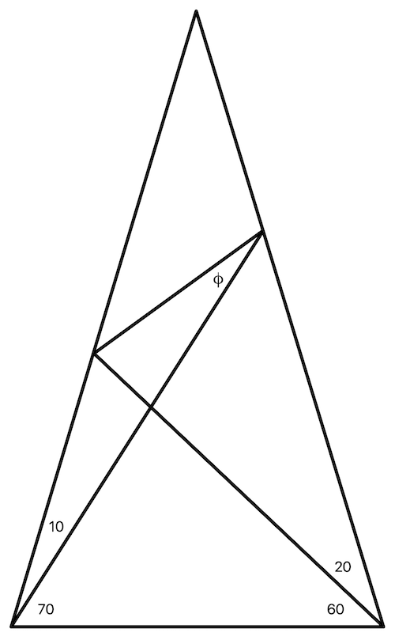

# The Triangle Puzzle

I came across an interesting mathematical puzzle, namely, find the value of the angle 𝜙 in the triangle shown in the figure below. It turns out that it's a surprisingly non-trivial problem to solve. I like a mathematical challenge so... I solved a more general version of the problem, where the angles at the bottom are arbitrary.

## License

I'm sharing this work under the [Creative Commons Attribution-ShareAlike 4.0 International (CC BY-SA 4.0)](http://creativecommons.org/licenses/by-sa/4.0/) license. See the LICENSE file for more information.
